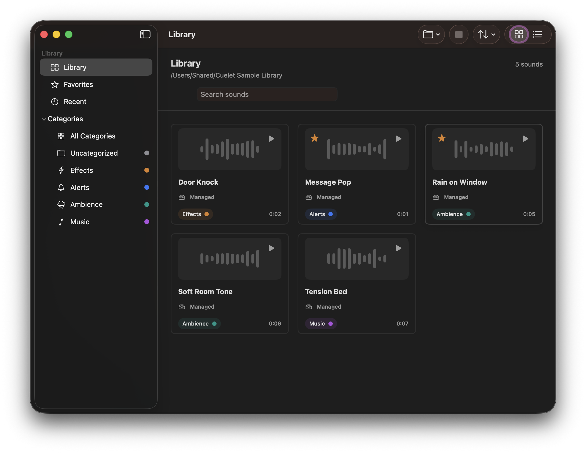
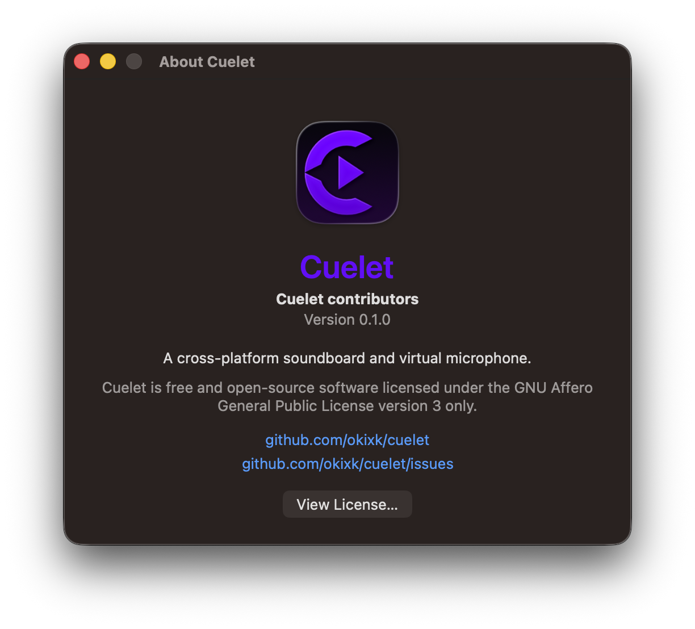
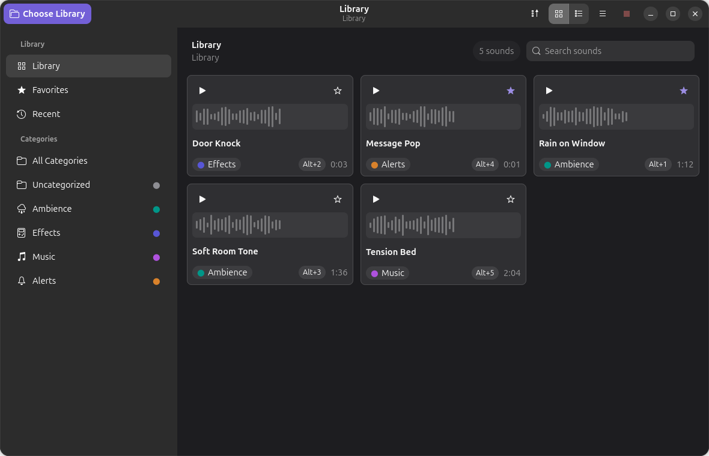
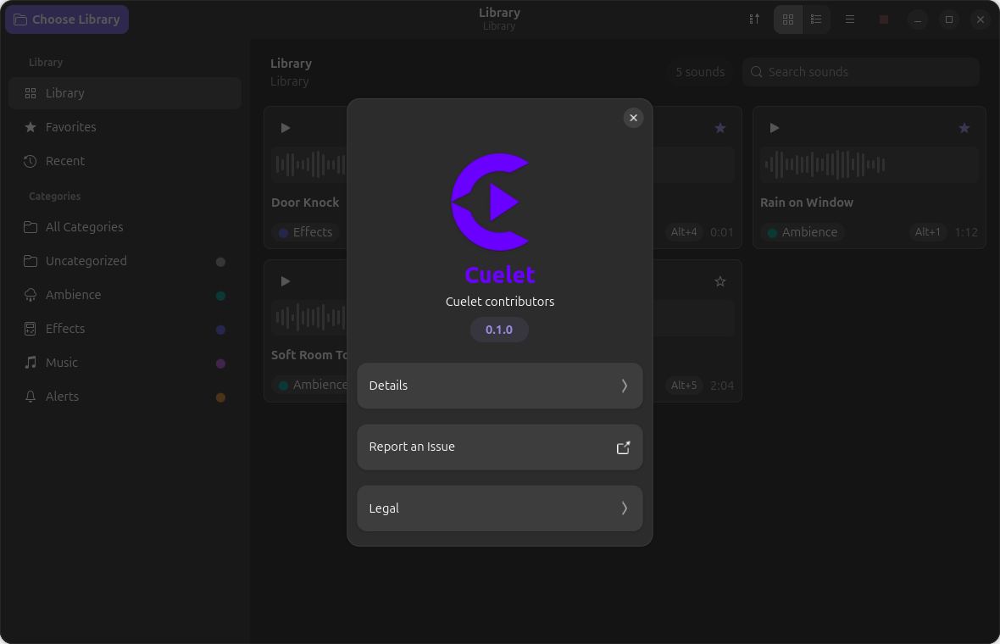
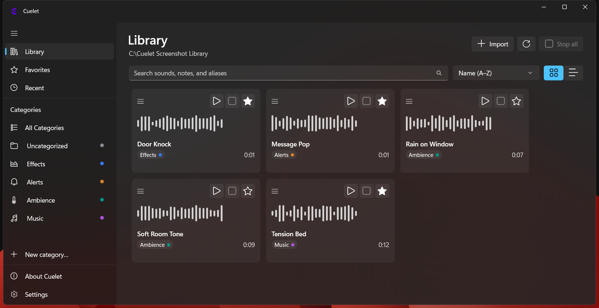
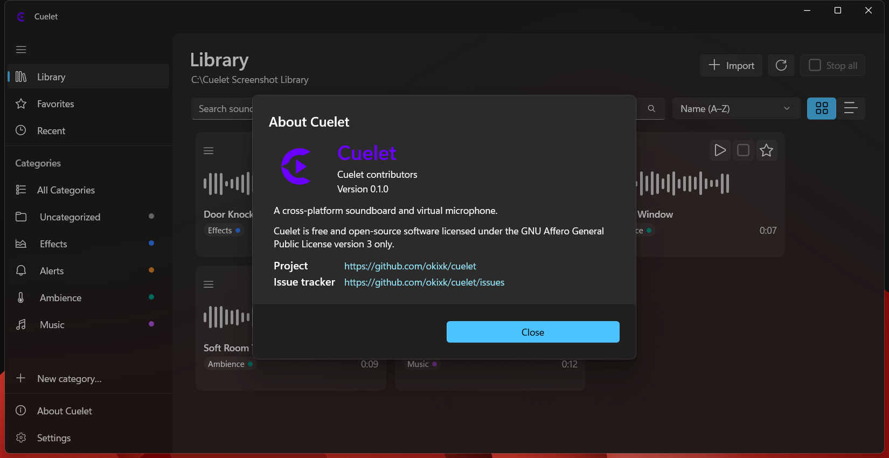

# Cuelet

Cuelet is a native desktop soundboard for organizing, finding, and playing audio clips during calls, streams, tabletop sessions, voice chat, and live cues. Each supported platform has a native interface and integrates with its own audio stack.

## Screenshots

### macOS

<table>
  <tr>
    <th width="68%">macOS — Library</th>
    <th width="32%">macOS — About Cuelet</th>
  </tr>
  <tr>
    <td></td>
    <td></td>
  </tr>
</table>

### Linux

| Sound library | About Cuelet |
| --- | --- |
|  |  |

### Windows

| Sound library | About Cuelet |
| --- | --- |
|  |  |

## Features

- Folder-based sound libraries with safe copy and link imports.
- Search, favorites, recent sounds, categories, notes, aliases, and grid/list views.
- Multiple simultaneous sounds, pause/resume, Stop All, volume control, and output selection.
- Per-sound local and global shortcuts.
- Portable `.cuelet-metadata.json` library metadata with conservative migration and recovery.
- Native virtual-microphone routing on macOS, Windows, and Linux, subject to the platform notes below.
- No system-default audio-device changes.

## Platform status

Cuelet 0.1.0 is pre-1.0 software. The root [`VERSION`](VERSION) file is the
authoritative application release version; platform manifests are checked
against it. The native applications are implemented and covered by platform
tests. Beta distribution follows the signing policy below; production
publication work is tracked separately.

| Platform | Native UI | Minimum / validated environment | Virtual microphone |
| --- | --- | --- | --- |
| macOS | SwiftUI/AppKit | macOS 14+, Apple Silicon build | Installer package includes the HAL driver; Developer ID signing/notarization still required |
| Linux | GTK4/libadwaita | GTK 4.10+, libadwaita 1.5+, GStreamer 1.20+ | App-owned PipeWire route; requires `pw-loopback` and PipeWire GStreamer support |
| Windows | WinUI 3 / C++/WinRT | Windows 10 1809+; Windows 11 recommended | Release uses a separately installed VB-CABLE pair; Cuelet's own driver remains development-only |

## Beta distribution policy

Cuelet 0.x beta builds are intentionally distributed without production code
signing on macOS and Windows. Platform security warnings may therefore
appear. Production signing is planned once the beta has received sufficient
real-world testing.

- macOS beta artifact: unsigned Installer package.
- Windows beta artifact: unsigned portable ZIP, not an end-user MSIX.
- Linux beta artifact: x86_64 tar archive with no configured signing scheme.

This policy applies to beta distribution and does not remove the future
production-signing infrastructure.

## Build

### macOS

Requirements: Xcode command-line tools and Swift 5.10 or newer.

```bash
cd apps/macos
swift build
swift test
./scripts/build-macos.sh
./scripts/build-release-package.sh --local
./scripts/build-release-package.sh --beta-unsigned
open dist/macos/Cuelet.app
```

The local app bundle and bundled HAL are ad-hoc signed for verification only. The local Installer package exercises the real application and system-driver destinations but is not distributable. The explicit beta package has an unsigned outer product archive, ad-hoc signed app and driver payloads, and emits `Cuelet-0.1.0-beta.1-macos-arm64-unsigned.pkg`; macOS security warnings are expected. Building never installs the package or driver. See [apps/macos/README.md](apps/macos/README.md) for package modes, signing hooks, and driver compatibility details.

### Linux

Install a C++ compiler, Meson, Ninja, GTK4, libadwaita, GStreamer, and JSON-GLib development packages, then run:

```bash
meson setup apps/linux/build/release apps/linux --buildtype=release -Dwerror=true
meson compile -C apps/linux/build/release
meson test -C apps/linux/build/release --print-errorlogs
```

See [apps/linux/README.md](apps/linux/README.md) for distribution packages, optional PipeWire dependencies, and user-local installation.

### Windows

Requirements: Visual Studio with MSVC x64, Windows App SDK dependencies, and a supported Windows SDK.

```powershell
powershell -ExecutionPolicy Bypass -File .\apps\windows\scripts\build-windows.ps1 -Configuration Release
powershell -ExecutionPolicy Bypass -File .\apps\windows\scripts\test-windows.ps1 -Configuration Release
powershell -ExecutionPolicy Bypass -File .\apps\windows\scripts\package-windows-beta.ps1
```

The 0.x public beta is an intentionally unsigned portable ZIP. Ordinary
Release builds and the MSIX route remain available for validation and future
signed releases, and exclude the development/test-signed virtual-audio
package. See [apps/windows/README.md](apps/windows/README.md) for packaging and
the current driver-signing boundary.

## Repository layout

```text
apps/macos/                 Native macOS app and HAL driver
apps/linux/                 Native Linux app
apps/windows/               Native Windows app and driver development tree
core/cuelet-core/           Shared C++ library and metadata model
docs/                       Architecture, schema, and developer validation records
scripts/                    Shared release-validation tooling
```

## Current limitations

- Production macOS binaries require Developer ID signing, hardened-runtime review, notarization, and stapling. The Installer-package structure is implemented; the 0.x beta package is intentionally unsigned.
- The Windows 0.x beta is distributed as an unsigned portable ZIP; a real publisher identity and signed MSIX remain future-release requirements. The Release route relies on separately installed VB-CABLE; Cuelet's development driver remains excluded until it has Microsoft-compatible production signing.
- Linux virtual-microphone behavior depends on the host PipeWire/session environment and available GStreamer plugins.
- Cuelet does not currently apply loudness normalization, compression, limiting, acoustic echo cancellation, or clip editing.
- Current macOS builds are arm64-only. Cross-architecture artifacts have not been prepared.

## Documentation

- [macOS build and architecture](apps/macos/README.md)
- [Linux build and runtime integration](apps/linux/README.md)
- [Windows build and packaging](apps/windows/README.md)
- [Portable metadata schema](docs/metadata-schema.md)
- [Architecture](docs/architecture.md)

Detailed validation records remain in `docs/cross-platform-catch-up/` for developers; they are not required for normal use.

## License

Cuelet is licensed under the [GNU Affero General Public License v3.0 only](LICENSE).
